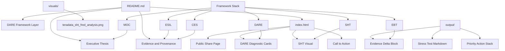

# Domenic Teradata Meeting | AI Governance Accountability Brief


## Executive Purpose

This repository packages an executive AI governance stress test prepared for a Teradata focused conversation with Domenic Ravita. The core finding is simple: Teradata has strong platform governance language, but public evidence does not confirm a named client side operations sponsor responsible for closing the post deployment accountability loop.

The repository is designed to make that finding easy to review, defend, and convert into a paid discovery or advisory conversation.

## Strategic Thesis

> Automated governance is not the same as accountability architecture.

Teradata can deploy guardrails, evaluations, compliance checks, and platform controls. The strategic question is whether the client organization has a named operational owner who is responsible for reviewing AI behavior, validating outcomes, detecting drift, and closing the Measure to Manage loop after deployment.

That is the advisory opening.

## DARE Layer Interpretation


The DARE layer evaluates whether an organization is simplifying decision reality or adding complexity that hides accountability.

| DARE Dimension | Meaning | Teradata Meeting Application |
|---|---|---|
| **D: Data** | Where insight exists but is not converted into governed action | Platform telemetry and agent reasoning visibility are necessary, but not sufficient |
| **A: Agility** | Whether assumptions expire before they become structural risk | Data warehouse era governance assumptions may not fit autonomous AI deployment |
| **R: Risks** | Whether the organization can face disruption before regulation forces it | Compliance as cover risk emerges when guardrails are treated as accountability |
| **E: Evolution** | Whether leadership is building from future operating conditions or legacy comfort | The winning posture is AI governance with named operational ownership |

### DARE Compression

```text
DEFINE the real system
ASSESS the accountability gap
REFRAME the gap into executive risk
EXECUTE through a paid advisory entry point
```

The practical DARE output is not a theory. It creates a conversation wedge: where does Teradata's platform capability end, and where must client side governance ownership begin?

## Framework Stack

| Layer | Role | Output |
|---|---|---|
| ESIL | External Signal Intelligence Layer | Regulatory, academic, and market signal scan |
| MOC | Model of Constraint | Identifies the binding bottleneck |
| CES | Composite Enforcement Score | Tests whether governance criteria remain valid |
| SHT | Systemic Harm Threshold | Scores extraction or dependency risk |
| DARE | AI adoption intelligence layer | Converts complexity into an executive entry point |
| EBT | Evaluative Bias Transference | Flags compliance as cover and accountability laundering |

## Repository Architecture



## Recommended Folder Structure

```text
domenic-terradata-meeting/
├── README.md
├── index.html
├── output/
│   ├── teradata-ai-governance-stress-test.md
│   ├── evidence-delta-block.md
│   └── priority-action-stack.md
├── visuals/
│   └── teradata_sht_fred_analysis.png
├── frameworks/
│   ├── dare-layer.md
│   ├── esil-v1.md
│   ├── sht-scorecard.md
│   ├── ces-layer.md
│   └── moc-layer.md
└── client-briefs/
    └── domenic-teradata-executive-brief.md
```

## Core Finding


Public positioning supports Teradata's platform governance capability. It does not publicly confirm a required client side operations sponsor embedded in the engagement model. That distinction matters because regulatory, operational, and board level accountability increasingly require named human ownership.

## SHT Scorecard


The current SHT read shows two breach signals:

| Dimension | Score | Interpretation |
|---|---:|---|
| Regulatory Independence | 10/20 | Platform guardrails do not fully replace accountability ownership |
| Narrative Transparency | 8/20 | Governance language risks overstating what the platform solves |
| Tax Structure Alignment | 13/20 | Moderate alignment |
| Subsidy Dependence | 14/20 | Meets alignment floor |
| Labor Integrity | 16/20 | Strongest dimension |

## Executive Conversation Hook

Use this line when opening the Teradata conversation:

> The gap I am seeing is not whether Teradata can govern models at the platform layer. The gap is whether the client has a named operations sponsor responsible for closing the post deployment accountability loop.

## Priority Action Stack

| Priority | Action | Purpose |
|---:|---|---|
| 1 | Lead with the operations sponsor question | Establish the real governance gap |
| 2 | Position automated governance versus accountability architecture | Make the insight memorable |
| 3 | Use DARE to show complexity hiding ownership | Convert analysis into executive clarity |
| 4 | Offer a short paid sprint | Convert interest into a funded next step |
| 5 | Produce a one page accountability map | Make the deliverable tangible |

## Suggested 4 Week Sprint


| Week | Workstream | Deliverable |
|---|---|---|
| 1 | Governance signal scan | Current state accountability map |
| 2 | Decision loop review | Measure to Manage gap analysis |
| 3 | Sponsor and ownership design | Operations sponsor role blueprint |
| 4 | Executive synthesis | Board ready AI accountability brief |

## GitHub Pages Deployment

1. Place `index.html` in the repository root.
2. Place the SHT image at `visuals/teradata_sht_fred_analysis.png`.
3. In GitHub, open **Settings**.
4. Select **Pages**.
5. Set source to **Deploy from a branch**.
6. Choose `main` and `/root`.
7. Save.

Your public page will be available from the GitHub Pages URL generated by the repository.

## Provenance

**McDonald (2026)**  
Epoch Frameworks LLC  
DACR License v2.6  
Decision support instrument, not a third party audited measurement.
